# برنامه حسابداری 🧮

## توضیحات 🌠

یک برنامه‌ی سبک حسابداری نوشته‌شده با پایتون و **PySide2** برای مدیریت تراکنش‌ها، حساب‌ها و گزارش‌های پایه. داده‌ها در قالب فایل **SQLite3** ذخیره می‌شوند.

---

## پیش‌نیازها 📦

* پایتون **3.6 – 3.9** (نسخهٔ 3.9 یا پایین‌تر)
  [https://www.python.org/downloads/release/python-390/](https://www.python.org/downloads/release/python-390/)
* فریمورک **PySide2**

```bash
path_to_python_3.9 -m pip install PySide2
```

* کتابخانه **peewee**

```bash
path_to_python_3.9 -m pip install peewee
```

* **SQLite3** (در پایتون گنجانده شده؛ نیازی به نصب جدا نیست)

---

## نصب و اجرا ▶️

```bash
git clone https://github.com/nima-salamat/accounting-app.git
cd accounting-app

# نصب وابستگی‌ها
path_to_python_3.9 -m pip install PySide2
path_to_python_3.9 -m pip install peewee

# اجرا
path_to_python_3.9 main.py
```

---

## مسیر و نام دیتابیس 🗂️

```
%LOCALAPPDATA%\accounting_app\app.db
# مثال:
C:\Users\<User>\AppData\Local\accounting_app\app.db
```

---

## فایل تنظیمات — `config.json` ⚙️

فایل `config.json` برای ذخیره تنظیمات برنامه استفاده می‌شود (مثل حالت تم یا اسکرین‌سیور).

نمونه:

```json
{
  "theme": "dark",
  "screensaver": "ball"
}
```

---

## لاگین پیش‌فرض 🔐

* **نام کاربری:** `admin`
* **رمز عبور:** `admin`

---

## محیط برنامه 📸

<table>
  <tr>
    <td align="center">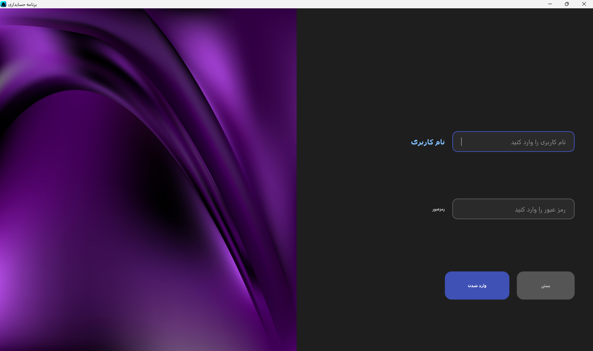</td>
    <td align="center">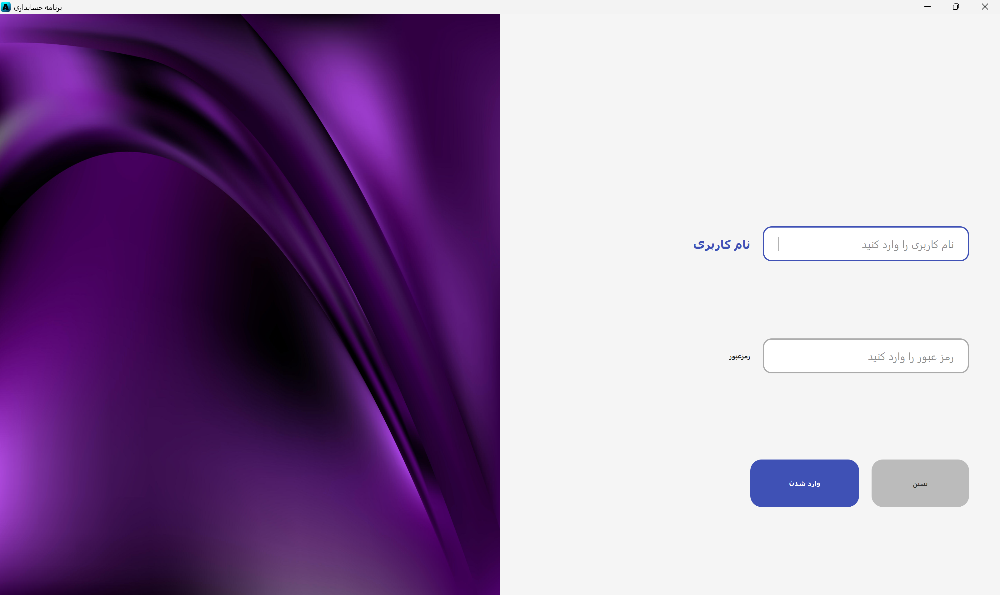</td>
  </tr>
  <tr>
    <td align="center">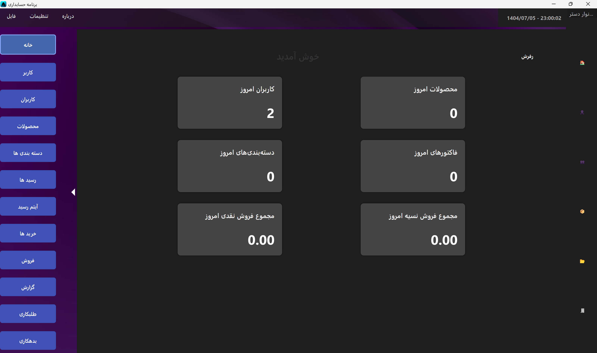</td>
    <td align="center">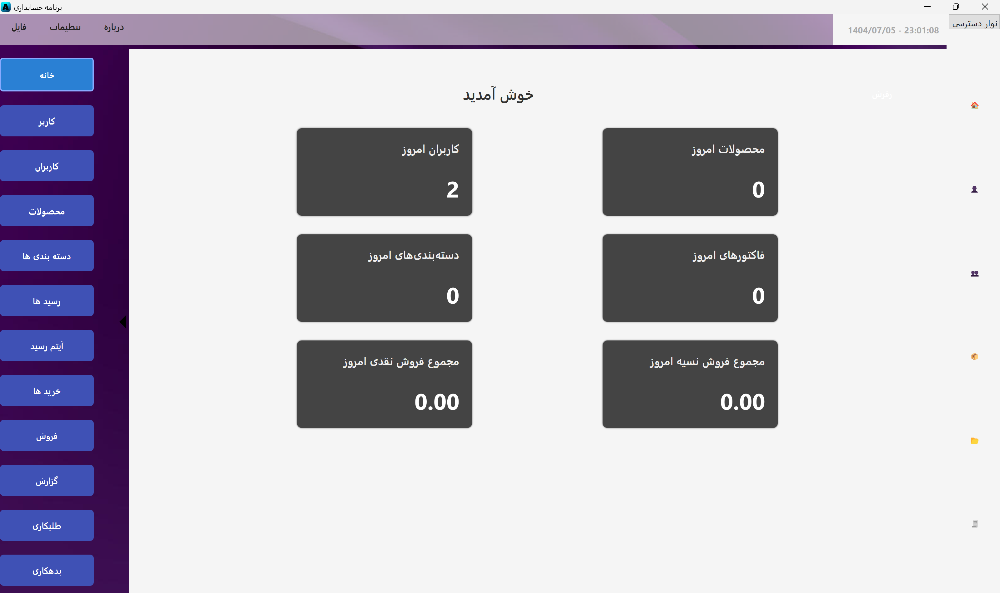</td>
  </tr>
  <tr>
    <td align="center">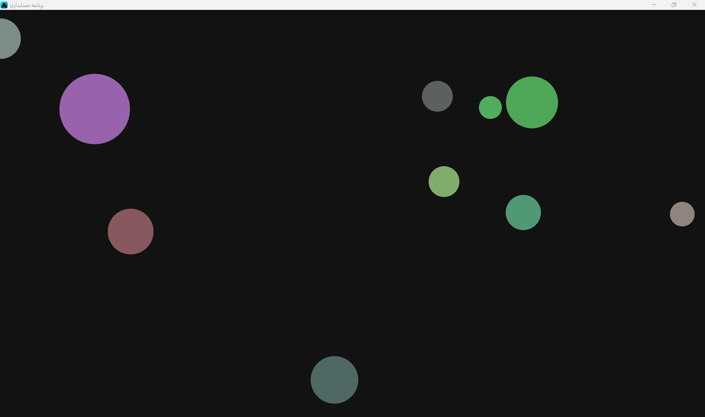</td>
    <td align="center">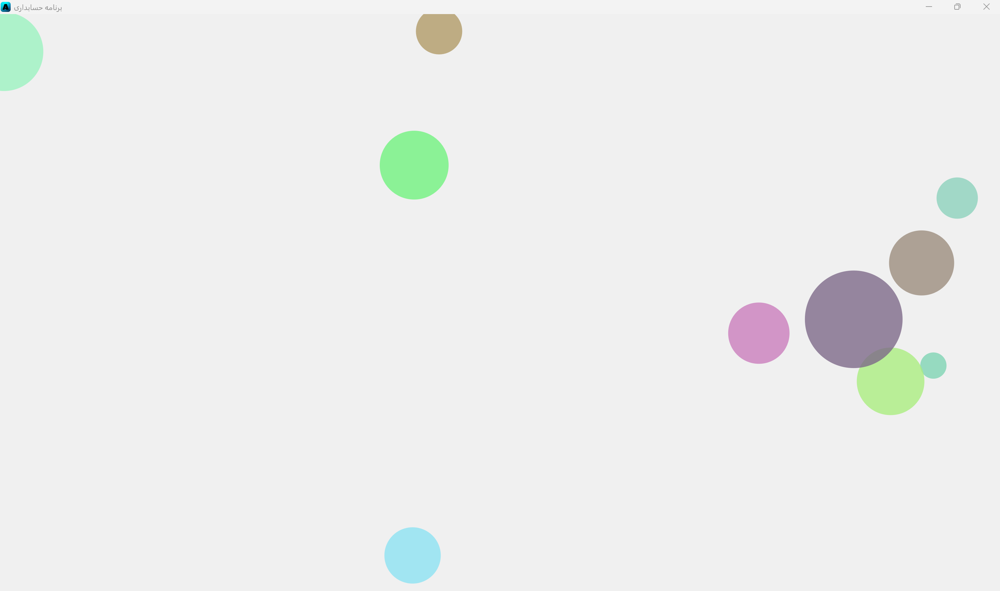</td>
  </tr>
  <tr>
    <td align="center">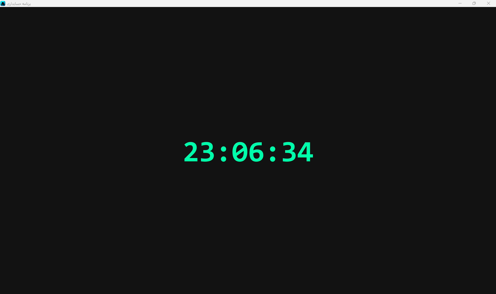</td>
    <td align="center">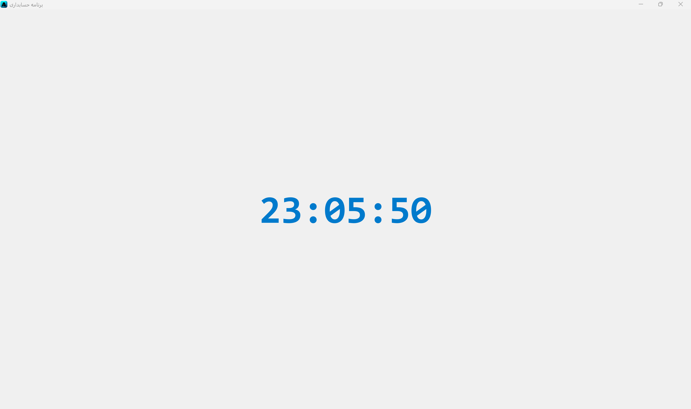</td>
  </tr>
  <tr>
    <td align="center">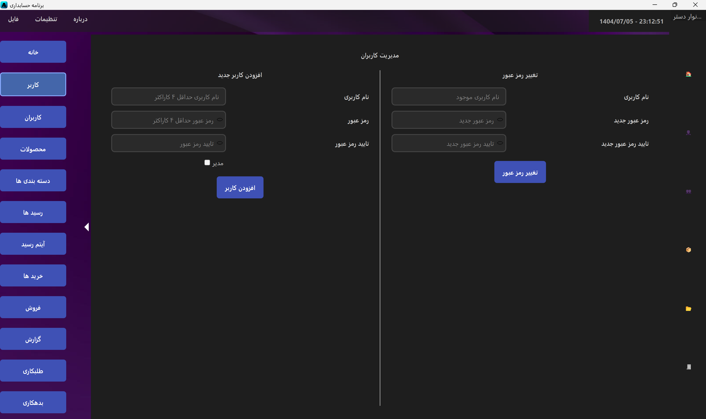</td>
    <td align="center">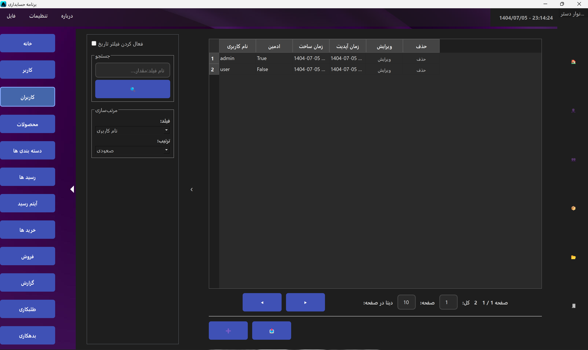</td>
  </tr>
  <tr>
    <td align="center">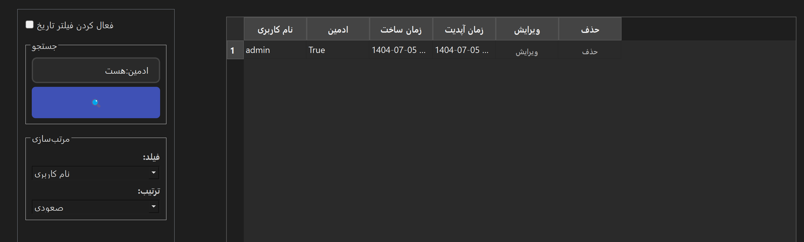</td>
    <td align="center">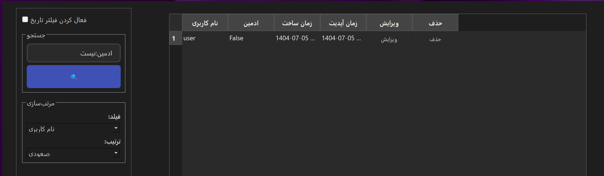</td>
  </tr>
  <tr>
    <td align="center">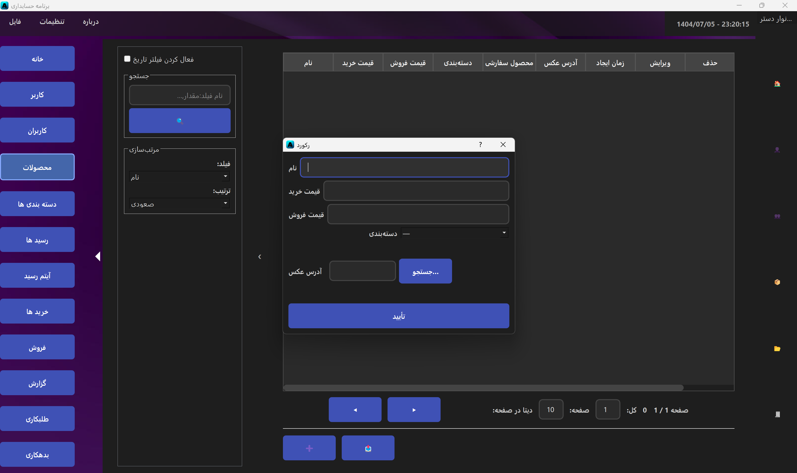</td>
    <td align="center">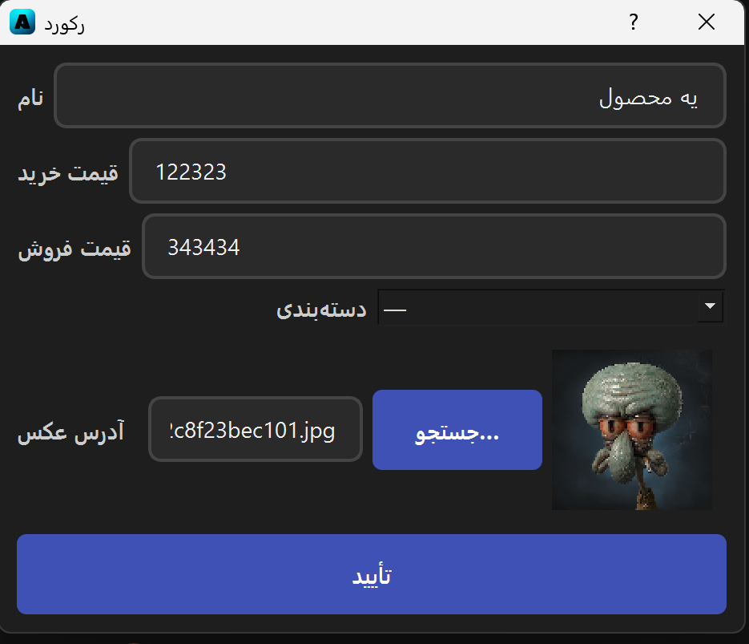</td>
  </tr>
</table>

